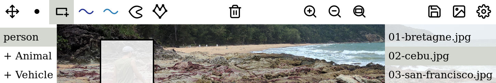

# Image annotation web application

In computer vision and image processing fields, the first task of almost every project consists in annotating images to create training datasets. Countless teams over the globe spend time and resources every day, simply to create a single use tool to prepare those datasets. This application aims at **solving** those **image annotation needs**, in the **simplest**, **most efficient form**.

The simplest tool, from a user perspective, is immediately available i.e. requires no additional installation to be fully functional. This is the reason why our image annotation application is a **Web application**. It is available at [http://annotation-app.pizenberg.fr](http://annotation-app.pizenberg.fr).

Image annotation tasks quickly become tedious, especially for big datasets and complex annotations like polygonal contours of shapes. Efficiency is met by minimizing the number of interactions, context switch, and visual overload. We value light user interface and optimize user experience by providing a **configurable interface** with a standard Json file. See more details in the "Getting started" page.

In the following pages, we describe our tool, its usage, and introduce the code structure if you are interested in contributing. It's [open source](https://github.com/mpizenberg/annotation-app) after all! Alternatives are presented in the last page if you're not convinced yet ;\)

