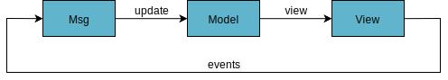
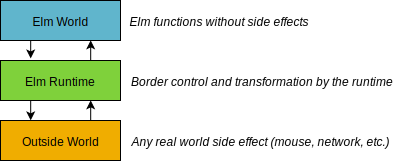
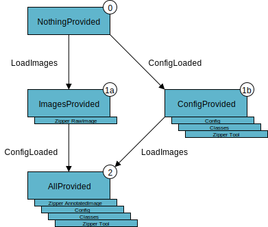
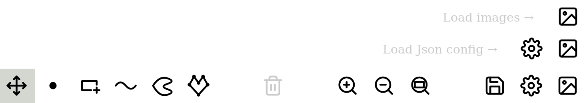

# Application code structure

This application is organized in two parts:

1. A minimalist Node.js static server, located in the `server/` directory.
2. A complete Elm client application, located in the `client/` directory.

## Server side: Express \(Node.js\)

We can simply show the whole code of the server since it fits in 21 lines of code, including imports:



```javascript
const express = require("express");
const app = express();
const path = require("path");
const cors = require("cors");
const compression = require("compression");

// Config based on .env file (transferred to process.env)
require("dotenv").config({ path: path.join(__dirname, ".env") });
const port = parseInt(process.env.SERVER_PORT, 10);
const distDir = path.join(__dirname, process.env.DIST_DIR);

// Middlewares
app.use(compression()); // gzip

// Serve statically the dist/ directory (build artefact)
app.use(express.static(distDir));

// Start server
app.listen(port, () => {
  console.log("Server listening on port %s", port);
});
```



It's basically serving the content of the `dist/` directory statically, with gzip compression since the generated `Main.js` file by the client application is roughly 1.2 MB raw but 150 KB gzipped.

## Client side: Elm

The whole client application, running in your browser is an [Elm](http://elm-lang.org/) application. Elm isn't a JavaScript framework, it's functional programming language compiling to JavaScript to run in browsers. Its syntax is inherited from Haskell but far simpler. I'd even argue that it is probably the best language to start programming in, thanks to its [super helpful compiler](http://elm-lang.org/blog/compiler-errors-for-humans).

### The application architecture

Since this is an Elm application, it follows TEA \(The Elm Architecture\). The simplest way of describing TEA is as a unidirectional data transformation flow. The central entity is the `Model`. It contains all and every information about our application state. The visual aspect of our application is called the `View`. The `View` is generated from and only from the `Model`. Meaning there is a function called `view` which takes a `Model`, and returns a `View` \(basically an HTML document\). And finally, all events  generate messages, of type `Msg`. We have a function called `update`, changing the model by reacting to those messages, closing the loop.



The above diagram is a simplistic representation of TEA from Elm point of view. In Elm code, all functions are "pure" in the functional jargon. Meaning that there is no side effect, meaning that outputs of functions are entirely defined by inputs. There cannot be global variables, real world events, network interaction etc. Basically a program like that would be running in a predestined way from its start to its end. We do not want that, since we want to load images, interact with them etc. This is why an elm program is attached to the Elm runtime, a huge piece of work, provided by the language, transforming all real world events \("side effects"\) into our defined set of messages, of type `Msg`.



Our actual program is better described by the following diagram. The main challenge to keep functions "pure" is to find a way to describe side effects without performing them. In a typical Elm program, side effects are described in three places:

1. View attributes as DOM events listeners.
2. Commands \(`Cmd`\) generated by the update function, like making http requests.
3. Subscriptions \(`Sub`\) to outside world events like the time ticking.

The Elm runtime takes those side effect descriptions, perform them, and, whenever there is a result / an answer, transforms it into a `Msg` of our choosing and route it to the update function.


### The model states

The model, that we described previously as the entity containing the complete state of our application, is a record containing four fields:

```text
type alias Model =
    { viewParameters : View.Parameters Msg
    , state : State
    , viewer : Viewer
    , dragState : Pointer.DragState
    }
```

* The `viewParameters` field contains cached parameters precomputed for the view function, like the current device type \(phone, tablet, computer\) depending on window dimension, or other view-related parameters.
* The `state` field contains the main state of our application i.e. the images loaded, the configuration chosen, the annotations performed etc. We will describe this further.
* The `viewer` field contains the entity recording movements coordinates relative to the image frame and zoom ratio, in order to display correctly the annotations on the image.
* Finally, `dragState` is constantly tracking the state of the pointer. Whether it is currently up or down and dragging from a given initial position.

The `state` is of type `State` defined as follows:

```text
type State
    = NothingProvided
    | ConfigProvided Config Classes (Zipper Tool)
    | ImagesProvided (Zipper RawImage)
    | AllProvided Config Classes (Zipper Tool) (Zipper AnnotatedImage)
```

It can be modeled as a finite state machine, visualized as the following diagram:



The application available at [https://annotation-app.pizenberg.fr/](https://annotation-app.pizenberg.fr/) starts in state 0 \(`NothingProvided`\) and provides a button to load images. In doing so, you reach state 1a \(`ImagesProvided`\), and then by providing a configuration you finally reach the state 2 \(`AllProvided`\). It is the state in which we can annotate images. State 1b \(`ConfigProvided`\) should only be reachable by providing a config in startup flags \(see last section\) and no image. Two messages called `LoadImages` and `ConfigLoaded` produce transitions in the state machine. They are detailed soon.

You may notice that images and tools are regrouped in collections called `Zipper`. A `Zipper` \([wikipedia](https://en.wikipedia.org/wiki/Zipper_%28data_structure%29), [lyahfgg](http://learnyouahaskell.com/zippers)\) is a very usefull collection. In our case, it is more or less a non empty list, in which at all times, there is one element selected. Since there is always a tool selected \(movement or annotation tool\) and always an image selected, it is the perfect collection type for this job.

### The messages

All modifications of the model are understood by looking at the `Msg` type. The `update` function then performs the modifications of the model described by such a message.


The following type definition may have change since this documentation was written. But for the purpose of describing the application behavior, it shouldn't be an issue.


```text
type Msg
    = WindowResizes Device.Size
      -- pointer events
    | PointerMsg Pointer.Msg
      -- select things
    | SelectImage Int
    | SelectTool Int
    | SelectClass Int
      -- files
    | LoadImages (List { name : String, file : Value })
    | ImageLoaded { id : Int, url : String, width : Int, height : Int }
    | LoadConfig Value
    | ConfigLoaded String
    | Export
      -- other actions
    | ZoomMsg ZoomMsg
    | RemoveLatestAnnotation
```

* The `WindowResizes` message is triggered when the application is resized. In the update function, it takes the new size and recomputes some view parameters and the annotation viewer.
* A `PointerMsg` message is triggered by pointer events \(mouse, touch, etc.\). In the update function, this is the message activating all the annotations logic code of our application.
* The messages `SelectImage`, `SelectTool` and `SelectClass` with their corresponding integer ids are generated when clicking on images, tools and classes in their respective bars.
* Files are handled by five messages. Those messages correspond to actions not entirely doable in Elm. They are thus partially handled through ports in JavaScript. Ports are explained in [the Elm guide](https://guide.elm-lang.org/interop/javascript.html) if you want to know more about them.
  * When selecting images in the file explorer to load, a `LoadImages` message is generated with a list of the images files and their names as identifiers. The update function will ask JavaScript to load each image into an `img` tag since this is not possible within Elm. For every image correctly loaded into an `img` tag, JavaScript sends it back to Elm in the `ImageLoaded` message, providing a local url, corresponding to the image in memory.
  * The same round trip to JavaScript is done to load the text content of the configuration Json file, with the messages `LoadConfig` and `ConfigLoaded`.
  * The `Export` message causes the application to serialize into Json all the annotations, and asks the user to save the generated file. It is triggered by clicking on the export button of the top action bar.
* Whenever an effect should change the zooming level of the drawing area, a `ZoomMsg` message should be generated. The update function will update relevant model fields according to the message.
* Finally, the `RemoveLatestAnnotation` message is stating that we should remove latest annotation of the current tool selected. The update function takes care of doing it, if possible.

### The view


The view of this application is based on four components, each implemented in its own module:

1. The top action bar \(`src/View/ActionBar.elm`\)
2. The center annotations viewer area \(`src/View/AnnotationsArea.elm`\)
3. The right images sidebar \(`src/View/DatasetSideBar.elm`\)
4. The left classes sidebar \(`src/View/ClassesSideBar.elm`\)

Each of those view components may have different versions depending on the current state of the application. The action bar for example have four versions:

* `emptyView : Parameters msg -> Element ...` : provides a bar with only one button to load images, in order to transition to the `ImagesProvided` state.
* `viewImages : Parameters msg -> Element ...` : provides an additional button to load a config, in order to transition to the `AllProvided` state.
* `viewAll : Parameters msg -> Zipper Tool -> Element ...` : provides a fully functional action bar, with the tools as specified in the configuration Json file.
* `viewConfig : Parameters msg -> Zipper Tool -> Element ...` : provides a preview of the configuration loaded but not yet actionable. This is not visible in the "normal" app transitions, only if start flags \(see next section\) provided in the `index.html` file provide a config but no image.



### Startup and interactions with JavaScript

As explained at the end of the crowd-sourcing page, the application is started in the `index.html` file with initial values called flags. Currently, flags contain four objects.

```javascript
// Set elm app flags
const flags = {
	deviceSize: containerSize(),
	mturkMode: true,
	images: [img],
	config: `{
		"classes": [],
		"annotations": [ "point", "bbox", "stroke", "outline", "polygon" ]
	}`
};

// Start elm app.
const app = Elm.Main.fullscreen(flags);
```

* `deviceSize` provides the initial size of the area allocated to the application in the html page.
* `mturkMode` toggles a mode in which the action bar view does not show the buttons to load images or load a config. It also replaces the icon button to export annotation by a textual "Submit" button.
* `images` contains a list of images \(url, width, height\) with an already available url, without having to locally load them in memory from the disk.
* `config` can provide an already defined configuration, to avoid having to load a Json file later.

The "normal" application, introduced in the Getting started page is started with no preloaded image or configuration. That is why it starts in the `NothingProvided` state. In order to reach the `ConfigProvided` state \(1b\), one should use flags with a valid config, and an empty images array.

```javascript
// Startup flags for the "normal" application
const flags = {
	deviceSize: containerSize(),
	mturkMode: false,
	images: [], // instead of [img]
	config: null // instead of an actual Json config text
};
```

Once the application is started, almost everything is managed using the Elm language. There are some interactions however, that still require communication with JavaScript due to lack of cover of some Web APIs in the Elm language. All **those interactions with JavaScript are called ports**, and are specified in two files:

* The file `src/Ports.elm` in Elm side.
* The file `static/ports.js` in JavaScript side.

Those files are extremely small, and as such, we can put them here for explanations.



```text
port module Ports exposing (..)

import Json.Encode exposing (Value)
import Packages.Device as Device exposing (Device)

port resizes : (Device.Size -> msg) -> Sub msg

port loadImageFile : { id : Int, file : Value } -> Cmd msg

port imageLoaded : ({ id : Int, url : String, width : Int, height : Int } -> msg) -> Sub msg

port loadConfigFile : Value -> Cmd msg

port configLoaded : (String -> msg) -> Sub msg

port export : Value -> Cmd msg
```



Each name in the previous `Ports.elm` file is explicit so I will just comment on the return types of those ports. Each port returns either a `Cmd` \(command\) or a `Sub` \(Subscription\). From Elm side, a port generating a command is an outgoing port \(to JavaScript\) and a port generating a subscription is an incoming port. From JavaScript side, the relation to ports are reversed. Consequently, in the JS code, we "subscribe" to Elm outgoing ports and "send" to an Elm incoming port. You can see that in the `ports.js` file. Ports usually come in outgoing-incoming pairs but not necessarily. The `resizes` incomming port has no outgoing counterpart, and the reverse is true for the `export` port.



```javascript
// Inform the Elm app when its container div gets resized.
window.addEventListener("resize", () =>
  app.ports.resizes.send(containerSize())
);

// Create an image object and send it back to the Elm app.
app.ports.loadImageFile.subscribe(value => {
  utils
    .createImageObject(value.id, value.file)
    .then(image => app.ports.imageLoaded.send(image))
    .catch(error => console.log(error));
});

// Read config file as text and send it back to the Elm app.
app.ports.loadConfigFile.subscribe(file => {
  utils
    .readJsonFile(file)
    .then(fileAsText => app.ports.configLoaded.send(fileAsText))
    .catch(error => console.log(error));
});

// Export / save annotations
app.ports.export.subscribe(value => {
  utils.download(JSON.stringify(value), "annotations.json", "application/json");
});
```



Currently these ports are only designed to fit the needs of our Elm application. But if we shift a bit our point of view, **those ports can actually be interpreted as an API**. Since the Elm language is not very popular \(yet ^^\), one could simply create ports exposing to JavaScript functionalities \(messages\) of the application, and treat the Elm application just like a remote server.

