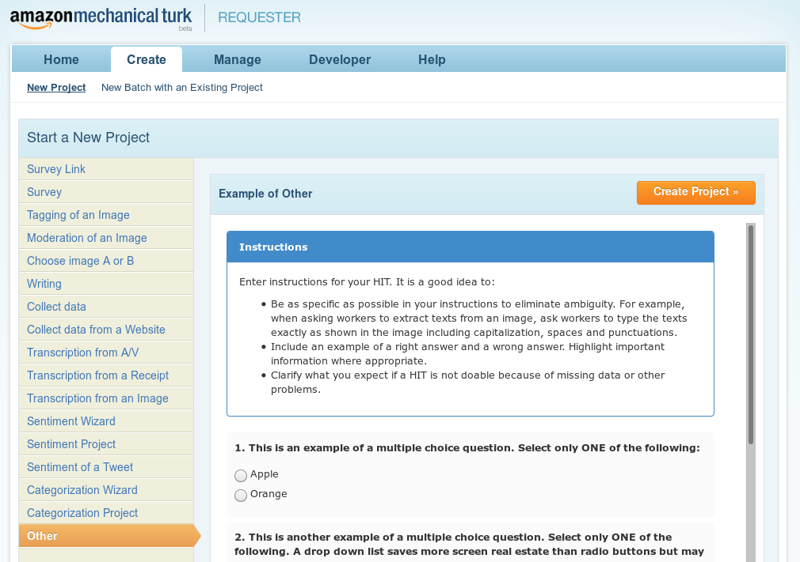
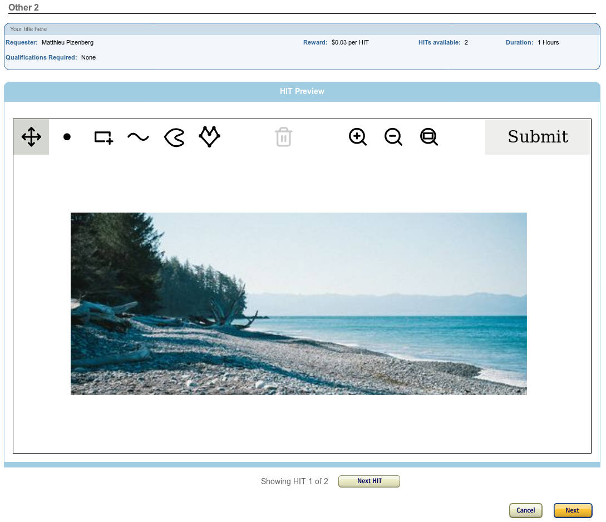

# Crowd-sourcing annotation tasks

To annotate a small amount of data, one can just do it on their computer. For this, the default interface is supposed to be a perfect match. At the other end of the spectrum, some annotation tasks are just too huge, and need to be crowd-sourced. [Amazon Mechanical Turk](https://www.mturk.com/) \(mturk\) is the perfect service for that. It comes in two sides. A "**requester**" is defining a set of tasks while a "**worker**" is performing those tasks. Workers are payed by requesters through mturk service.

Mturk is based on the concept of a "**HIT**" \(Human Intelligence Task\) as the task unit. The simplest way of quantification in our case is **one image** ↔ **one HIT**. In the following, I will describe first how to set up accounts on mturk, then how to use this annotation application for the HITs.

## Registering for sandbox accounts

Defining "real" tasks on mturk is obviously going to cost you money. But fortunately, mturk also have testing equivalent of the normal requester and worker environments, called **sandbox** environments. So the first thing to do is registering for a [requester sandbox](https://requestersandbox.mturk.com/) and a [worker sandbox](https://workersandbox.mturk.com/) account.

## Creating a project template

As a requester, create a new project by going to the "Create" tab and clicking on "New Project".


Go to the "Other" category and click on "Create Project &gt;&gt;".



In the tab "\(1\) Enter Properties", fill the fields as you wish but you need to set a "Reward per assignment", and at the question "Require that Workers be Masters to do your HITs", answer "No" to be able to test your own HITs. Once filled, click on the bottom button "Design Layout" to validate and go to the next tab. You will get a page looking like this one.


Now click on the "Source" button to edit the source code, and replace the code by the following one. The structure of this chunk of code is explained in following sections.



```markup

<div>
	<input type="hidden" value="" name="annotation-data" id="annotation-data"/>
	<style>html, body, .style-elements { height: 100% } #mturk_form { display: none }</style>
	<script src="https://annotation-app.pizenberg.fr/elm-pep.js"></script>
	<script src="https://annotation-app.pizenberg.fr/Main.js"></script>
	<script charset="utf-8">
		// Function returning the size of the container element for the app.
		// In our case, the full layout viewport.
		const layoutViewportSize = () => ({
			width: document.documentElement.clientWidth,
			height: document.documentElement.clientHeight
		});
		const containerSize = layoutViewportSize;

		// The image to display
		const img = {
			width: ${img_width},
			height: ${img_height},
			url: "${img_url}"
			// comment to prevent mturk templating system to merge those two '}'
		};

		// Set elm app flags
		const flags = {
			deviceSize: containerSize(),
			mturkMode: true,
			images: [img],
			config: `{
				"classes": [],
				"annotations": [ "point", "bbox", "stroke", "outline", "polygon" ]
			}`
		};

		// Start elm app.
		const app = Elm.Main.fullscreen(flags);
	</script>
	<script src="https://annotation-app.pizenberg.fr/ports-mturk.js"></script>
</div>

```



Now your editing area should look like the following.


If the "Source" button is not pressed, it means that mturk had a bug. It happens sometimes, due to sign out or other mysterious mturk events. If you are like this, with the "Source" button pressed and the code pasted in, we can continue. Click again on the "Source" button to leave the source mode. Now you should have something looking like the following, which is totally normal.


Now click on the bottom "Preview" button. It moves you to the third tab. A notification like "Your project was successfully saved." and a preview of what your HIT would look like. The preview should be empty. Again, **this is normal, don't panic** ;\). In case you open your JavaScript browser console, you will even see a runtime error, of the kind "SyntaxError: missing } after ...". This error is due to mturk templating system. You will understand the reason for this in the next section. Now simply click on the bottom "Finish" button and you are done with the project template. You should be back to the "Create" tab with a new project entry looking like the following.


## Publishing a batch of HITs

Now that our template is ready, we can generate all our HITs with just one CSV file. Click on the "Publish Batch" button to create a batch of HITs. Load a [CSV file](https://mpizenberg.github.io/resources/annotation-app/mturk-batch.csv) containing the following text \(with no extra space! be careful\).



```text
img_width,img_height,img_url
500,200,https://picsum.photos/500/200
500,300,https://picsum.photos/500/300
```



Mturk will process the csv file, make the entries match to our template html, and generate template previews that should be correct this time around.



Hit \(pun intended\) the bottom right "Next" button. On the next page, adjust the batch name and other fields, and hit "Publish". That's it! Your tasks are now published, and should be available in roughly a minute to sandbox workers. In your "Manage" tab, you can now follow the progress of your HITs.


## Worker side

Now that your batch is published simply connect to the [worker sandbox site](https://workersandbox.mturk.com) and look for your tasks. I'll let you explore on your own.

## Customizing the template


Please read first the Getting started page to understand this section.


Just like with the normal version of this app, the mturk version can also be configured to only display the tools you need for your HITs. Let's have a second look at the template html file.



```markup
<div>
	<input type="hidden" value="" name="annotation-data" id="annotation-data"/>
	<style>html, body, .style-elements { height: 100% } #mturk_form { display: none }</style>
	<script src="https://annotation-app.pizenberg.fr/elm-pep.js"></script>
	<script src="https://annotation-app.pizenberg.fr/Main.js"></script>
	<script charset="utf-8">
		// Function returning the size of the container element for the app.
		// In our case, the full layout viewport.
		const layoutViewportSize = () => ({
			width: document.documentElement.clientWidth,
			height: document.documentElement.clientHeight
		});
		const containerSize = layoutViewportSize;

		// The image to display
		const img = {
			width: ${img_width},
			height: ${img_height},
			url: "${img_url}"
			// comment to prevent mturk templating system to merge those two '}'
		};

		// Set elm app flags
		const flags = {
			deviceSize: containerSize(),
			mturkMode: true,
			images: [img],
			config: `{
				"classes": [],
				"annotations": [ "point", "bbox", "stroke", "outline", "polygon" ]
			}`
		};

		// Start elm app.
		const app = Elm.Main.fullscreen(flags);
	</script>
	<script src="https://annotation-app.pizenberg.fr/ports-mturk.js"></script>
</div>

```



There are four important parts in this document.

1. The `<input>` element
2. The `#mturk_form` display style
3. The `const img` variable
4. The `const flags` variable

### The &lt;input&gt; element and \#mturk\_form display style

This whole template is embeded inside a form, in an iframe in the mturk worker website. The id of the form provided by mturk is `mturk_form`. When our application takes control of the iframe \(`const app = Elm.Main.fullscreen(flags);`\), it leaves the form and our scripts tags aside and starts a new hierarchical DOM element. So the DOM ends up with a structure like the following:

```markup
<body>
    <form id="mturk_form" method="post" action="https://workersandbox.mturk.com/mturk/externalSubmit">
        ... our input, style and script elements
    </form>
    <script language="Javascript">turkSetAssignmentID();</script>
    <div style="height: 100%;">
        ... our elm application
    </div>
</body>
```

Therefore our `<input value="" id="annotation-data"/>` is located inside the form and when the form will be submitted, the content of the input `value` will be submitted to mturk. The id `annotation-data` is thus important since it is used inside our `ports-mturk.js` script to update its value when clicking on the "Submit" button. The style `#mturk_form { display: none }` is applied because we do not want to clutter the interface with predefined mturk form, we want to manage the whole thing in our elm application.

### The image to display

Each HIT corresponds to a different image to work on. If you remember, in our CSV file, we have the following entries:



```text
img_width,img_height,img_url
500,200,https://picsum.photos/500/200
500,300,https://picsum.photos/500/300
```



Those `img_width`, ... correspond exactly to the html template variables used in the definition of the `img` variable:

```javascript
// The image to display
const img = {
	width: ${img_width},
	height: ${img_height},
	url: "${img_url}"
	// comment to prevent mturk templating system to merge those two '}'
};
```

### The elm application startup flags

When starting the elm application, we do the following:

```javascript
// Set elm app flags
const flags = {
	deviceSize: containerSize(),
	mturkMode: true,
	images: [img],
	config: `{
		"classes": [],
		"annotations": [ "point", "bbox", "stroke", "outline", "polygon" ]
	}`
};

// Start elm app.
const app = Elm.Main.fullscreen(flags);
```

In case you were asking yourself, yes, the "normal" application and the "mturk" version are actually the same application, started with different "flags". The "normal" application, introduced in the Getting started page is started with the flags:

```javascript
// Startup flags for the "normal" application
const flags = {
	deviceSize: containerSize(),
	mturkMode: false,
	images: [], // instead of [img]
	config: null // instead of an actual Json config text
};
```

The only thing that the `mturkMode` does is removing the buttons to load a config, load images, and replaces the export \(image\) button by a textual "Submit" button more familiar to mturk workers.

In conclusion, any config that you can use in the "normal" application, you can use here by just putting it inside the multiline string back quote character. So refer to the Getting started section to know how to choose the configuration that best suits your needs.

### The httpS constraint

Mturk website is accessed through a secured SSL layer in HTTPS \(not HTTP\). So every request happening in our iframe must also be sent through an HTTPS connection. This has two implications.

1. **All images addresses provided in your CSV file must be with an HTTPS address**
2. In case our website is down \(https://annotation-app.pizenberg.fr\) the scripts tags whith JavaScripts files hosted at our website \(Main.js, elm-pep.js, ports-mturk.js\) will fail loading, and your workers won't have anything displayed. **To be safe, you can decide to host yourself those files at an address of your choosing as long as it is HTTPS**.

