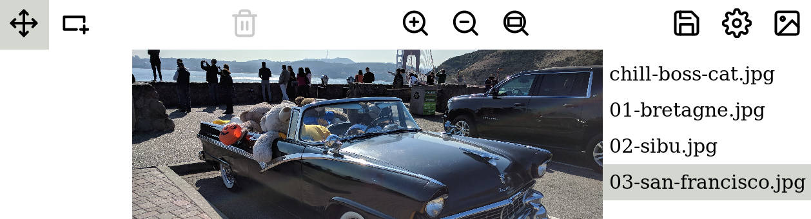
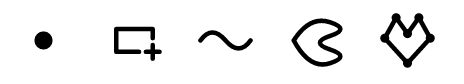
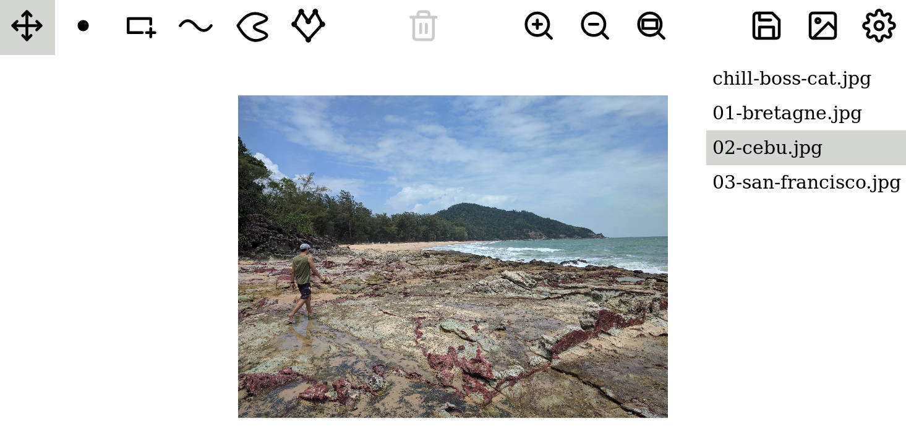
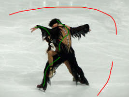
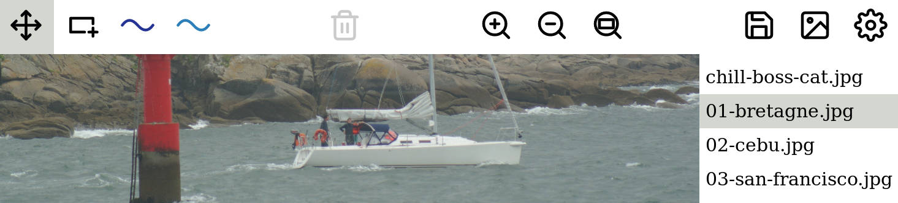
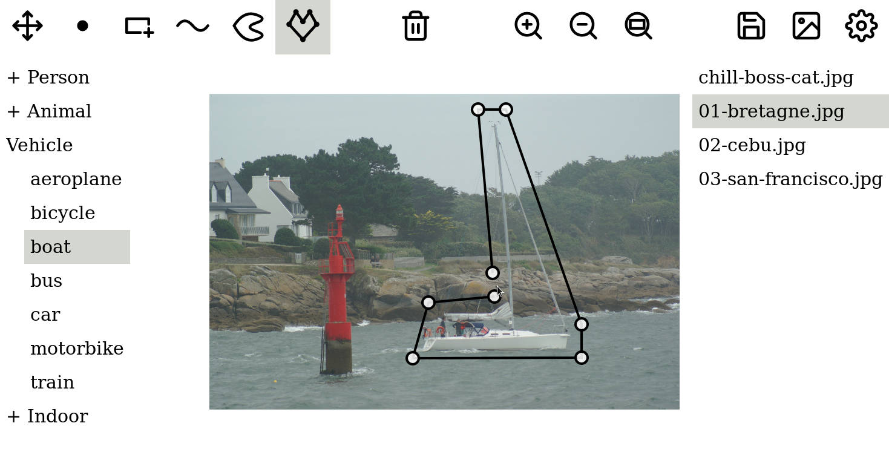
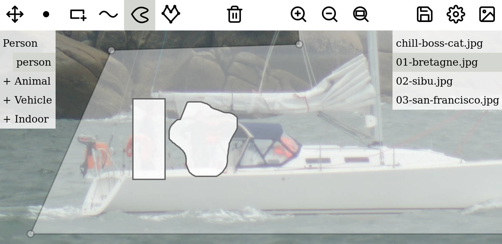
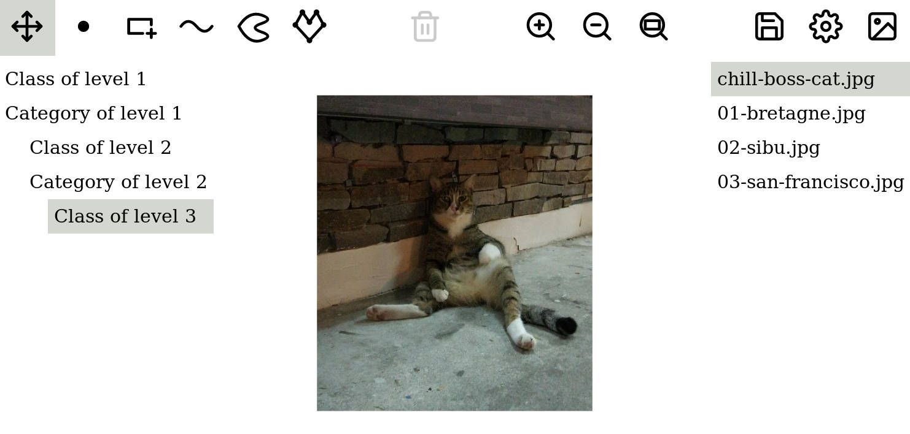

# Getting started

## Simplest use case: drawing a bounding box in an image

Let's imagine that you have this very peculiar and unique need of drawing a bounding box around one object, in a single image, and then get the coordinates of this bounding box in the image frame. Then you're in luck! No need look around to make sure nobody is seeing you measuring with your ruler on the screen and doing a highly complicated rule of 3 to get the bounding box coordinates! \(I know it happened at least once!\).

* Simply open a new tab at the annotation application address: [http://annotation-app.pizenberg.fr](http://annotation-app.pizenberg.fr).
* Click on the image icon in the top toolbar to load your image.
* Click on the config icon in the top toolbar and open a Json file containing `{ "annotations": [ "bbox" ], "classes": [] }` like this one: [`config-simple.json`](https://mpizenberg.github.io/resources/annotation-app/config-simple.json)
* Click on the bounding box icon in the toolbar.
* Draw your bounding box by click-dragging.
* Click on the save icon in the top toolbar to retrieve the bounding box coordinates.
* Done ;\)


When saving, it generates a Json file containing your annotations. You can paste the content of file `annotations.json `in [JSONLint](https://jsonlint.com/) to have a human readable content. In this case, you will get something like below \(indented slightly differently\).



```javascript
{ "config": { "classes":[], "annotations":["bbox"] }
, "images":
  [ { "image":"chill-boss-cat.jpg"
    , "annotations":
      [ { "type":"bbox"
        , "annotations": [ {"minX":675,"maxX":839,"minY":868,"maxY":1103} ]
}]}]}
```



The syntax of the saved Json file is detailed later but you can already see that the bounding box coordinates are given here as `minX, maxX, minY, maxY` values. Since it can be useful to have a reference of the config that was used while annotating, the config is prepended before all images annotations. We only have one image \("chill-boss-cat.jpg"\), one type of annotation \("bbox"\), and one annotation here but the syntax support many of each.

## Annotating multiple images {#annotating-multiple-images}

To have multiple images, simply click again on the top right image icon, and select one or multiples of them. Annotating multiple images is just like annotating one image. The only difference is that multiple images are available on the right sidebar. You can change image at any time by clicking on another one.



You may notice that the "chill-boss-cat.jpg" image is still available. That's because loading new images add them to the one already loaded. If you wish to clear the images list, simply reload the Web page.


Beware that the browser cannot access the disk without your consent. So images are loaded in memory since this application is purely client side \(no server interaction\). Consequently, you should avoid loading GB worth of images at the same time. Proceed by batches instead, and reload the page between each batch.



It is not currently possible to load a "folder" containing images due to browser restrictions. See issue [\#17](https://github.com/mpizenberg/annotation-app/issues/17) for more info. As an alternative, if you are not aware of it, you can select all files in a folder with the \[Ctrl+A\] keyboard shortuct in Windows and most Linux distributions, and \[Cmd+A\] in Mac.


## The annotation tools available {#the-annotation-tools-available}

The annotation tools available in this application with their configuration name are:

* Points: "point"
* Bounding boxes \(rectangles\): "bbox"
* Strokes \(lines\): "stroke"
* Outlines \(free draw closed shapes\): "outline"
* Polygons: "polygon"



Just like for our initial bounding box use case, we choose which annotation tool to provide with the Json config file \([`config-all-tools.json`](https://mpizenberg.github.io/resources/annotation-app/config-all-tools.json)\).



```javascript
{ "classes": []
, "annotations": [ "point", "bbox", "stroke", "outline", "polygon" ]
}
```



By providing such a config file when clicking on the top right config button, we get an interface like the following:



Then click on any tool of your choosing to start annotating with it. Usage of each tool should be simple enought that I do not need to explain how to use them. If you have difficulties understanding usage of one of them, please open an issue on the [github project page](https://github.com/mpizenberg/annotation-app/issues).


Annotations are not editable once done. You can only remove the last one of the current tool with the top delete icon and redo it. This approach has advantages but also issues for some interactions. Please refer to issue [\#20](https://github.com/mpizenberg/annotation-app/issues/20) for more info about this.


There is more! In addition to the five fundamental annotation types available \(point, bbox, stroke, outline, polygon\), **each type can be derived in virtually any number of variations**. Let's make a concrete example. To train image segmentation algorithms, we sometimes have to draw bounding boxes but also what are called "foreground" and "background" "scribbles". In the following image, you may spot green "foreground" and red "background" scribbles defining areas of the image being or not of interest.



To formalize these "variations" of an annotation type, we simply add a field to the Json config file \([`config-variations.json`](https://mpizenberg.github.io/resources/annotation-app/config-variations.json)\).



```javascript
{ "classes": []
, "annotations":
    [ "bbox"
    , { "type": "stroke", "variations": [ "fg", "bg" ] }
    ]
}
```



The previous config file, when loaded in the application, will generate the following interface.




Though tool variations icons have different colors, their respective annotations on the image are currently of the same color. This is a priority to fix. Follow issue [\#1](https://github.com/mpizenberg/annotation-app/issues/1) to get updated when this is fixed.


By using different variations of a tool, they will generate different annotation items in the exported Json file, similar to the file below.



```javascript
{ "config":
	{ "classes": []
	, "annotations": [ "bbox", { "type": "stroke", "variations": ["fg", "bg"] } ]
	}
, "images":
	[ { "image": "chill-boss-cat.jpg", "annotations": [ "..." ] }
	, { "image": "01-bretagne.jpg"
	  , "annotations":
		[ { "type": "bbox", "annotations": [ "..." ] }
		, { "type": "stroke", "variant": "fg", "annotations": [ "..." ] }
		, { "type": "stroke", "variant": "bg", "annotations": [ "..." ] }
		]
	  }
	, { "image": "02-cebu.jpg", "annotations": [ "..." ] }
	, { "image": "03-san-francisco.jpg", "annotations": [ "..." ] }
	]
}
```



You can choose any number of variations for any tool and give them the name you want. The semantic is yours to decide. It might be for example to distinguish between the visible and hidden part of an object, foreground or background, etc. One rule to remember is that **variations are not tailored to be applied on all your tools** but only on one or two. **If you find yourself in a situation where all your tools have the same variations in your config file, it means you need to use classes instead**. Jump to the next section to understand what classes are.


Though you could theoretically have any number of variations, I strongly suggest that you limit usage of variations to 3 or less variations. First, this will clutter your toolbar to a point where the interface is not usable anymore. Second, it strongly indicates that you should switch to usage of classes instead.


## Using classes or labels

For most annotation tasks, we also need to differentiate objects in the images. Typically each annotated area is attributed a "class" sometimes also called "label". The [PASCAL VOC](http://host.robots.ox.ac.uk/pascal/VOC/voc2012/) dataset for example is composed of 20 classes, grouped by category. Those classes are:

* _Person _: person
* _Animal _: bird, cat, cow, dog, horse, sheep
* _Vehicle _: aeroplane, bicycle, boat, bus, car, motorbike, train
* _Indoor _: bottle, chair, dining table, potted plant, sofa, tv/monitor

In our application, classes are specified in the Json config file. A strict corresponding config for PASCAL VOC classes would be as this [`config-pascal.json`](https://mpizenberg.github.io/resources/annotation-app/config-pascal.json) file:



```javascript
{ "classes":
    [ { "category": "Person", "classes": [ "person" ] }
    , { "category": "Animal", "classes": [ "bird", "cat", "cow", "dog", "horse", "sheep" ] }
    , { "category": "Vehicle", "classes": [ "aeroplane", "bicycle", "boat", "bus", "car", "motorbike", "train" ] }
    , { "category": "Indoor", "classes": [ "bottle", "chair", "dining table", "potted plant", "sofa", "tv/monitor" ] }
    ]
, "annotations": [ "point", "bbox", "stroke", "outline", "polygon" ]
}
```





To attribute a class to an annotation, first select the class in the left sidebar, then use your tool to create an annotation. Repeat the process with all objects to annotate in the image. When selecting a class in the left sidebar, it also highlights the annotations corresponding to this class. See for example in the image below how annotations of the class "person" are highlighted even if they are of different types.




Colors are not used to differentiate classes for multiple reasons. 20 classes like in the Pascal VOC case would not have great color differences and might not be color-blind friendly. Letting the user customize colors would also add a configuration burden and thus prevent us from reaching our goal of simple efficient annotations. Instead we are trying to set the best defaults possible, by relying more on contrasts than hues. Please [open an issue on github](https://github.com/mpizenberg/annotation-app/issues) if this really is a problem in your case.



It would also be useful to have classes informations next to annotated areas, to avoid searching in the classes sidebar for highlights. This is on the roadmap. Please follow issue [\#11](https://github.com/mpizenberg/annotation-app/issues/11) to get notified when this is available.


Classes can have any number of hierarchical levels in the configuration. Simply replace a class by an object with two keys "category" and "classes" like in the example below \([`config-subclasses.json`](https://mpizenberg.github.io/resources/annotation-app/config-subclasses.json)\).



```javascript
{ "classes":
    [ "Class of level 1"
    , { "category": "Category of level 1", "classes":
        [ "Class of level 2"
        , { "category": "Category of level 2", "classes": [ "Class of level 3" ]}
        ]
      }
    ]
, "annotations": [ "point", "bbox", "stroke", "outline", "polygon" ]
}
```






